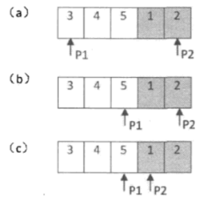

# 第3篇

知识点：二叉树、栈和队列、查找


# 二叉树

## 知识点

- 树的概念：分支节点、叶节点、度、深度……
- 二叉树的定义，满二叉树，完全二叉树
- 二叉树的五条性质
- 二叉树的存储方式（二叉链表广泛采用）
- 二叉树的遍历（前序、中序、后序）（递归、非递归），以及层次遍历（采用队列）

## 题目：重建二叉树

### 要求
输入某二叉树的前序遍历和中序遍历的结果，请重建出该二叉树。假设输入的前序遍历和中序遍历的结果中都不含重复的数字。例如输入前序遍历序列{1,2,4,7,3,5,6,8}和中序遍历序列{4,7,2,1,5,3,8,6}，则重建二叉树并返回。

### 思路
前序序列能确定根节点，用根节点，把中序划分为左右子树
基于递归的思路，重复上述步骤

### 代码
```python
# -*- coding:utf-8 -*-
# class TreeNode:
#     def __init__(self, x):
#         self.val = x
#         self.left = None
#         self.right = None
class Solution:
    # 返回构造的TreeNode根节点
    def reConstructBinaryTree(self, pre, tin):
        # 给定前序和中序，重建二叉树
        # 思路：前序结果可以确定树根，通过树根可以将中序切成左右两半
        if(len(pre)==0):
            return None
        root = TreeNode(pre[0])
        tin_root_index = tin.index(root.val)
        if tin_root_index > 0:  # 有左子树
            new_tin = tin[0: tin_root_index]
            new_pre = pre[1: len(new_tin)+1]
            root.left = self.reConstructBinaryTree(new_pre, new_tin)
        if tin_root_index != len(tin) - 1:  # 有右子树
            new_tin = tin[tin_root_index+1:]
            new_pre = pre[len(pre)-len(new_tin):]
            root.right = self.reConstructBinaryTree(new_pre, new_tin)
        return root
```

这个题主要是清楚前序和中序的特点，理清思路以后，算准确切分的下标，递归实现就行。
下标可以写的更简洁一点：

```python
        index = tin.index(root.val)
        if index > 0:  # 有左子树
            root.left = self.reConstructBinaryTree(pre[1: index+1], tin[0: index])
        if index != len(tin) - 1:  # 有右子树
            root.right = self.reConstructBinaryTree(pre[index+1: ], tin[index+1: ])
        return root
```


# 栈和队列

## 题目：用两个栈模拟队列
### 要求
用两个栈来实现一个队列，完成队列的Push和Pop操作。 队列中的元素为int类型。

### 思路
一个栈处理push，新节点放入该栈，一个栈处理pop，初始为空
当需要pop时，如果pop栈不空，则直接出栈，如果空，则从push栈弹出全部内容放到pop栈，pop栈出栈一个

### 代码
```python
# -*- coding:utf-8 -*-
class Solution:
    # 思路：
    # 一个栈处理push，新节点放入该栈，一个栈处理pop，初始为空
    # 当需要pop时，如果pop栈不空，则直接出栈，如果空，则从push栈弹出全部内容放到pop栈，pop栈出栈一个
    def __init__(self):
        self.push_stack = []
        self.pop_stack = []
    
    def push(self, node):
        self.push_stack.append(node)
        
    def pop(self):
        if len(self.pop_stack) == 0:
            if len(self.push_stack) == 0:
                print('Nothing to pop!')
                return None
            else:
                for i in range(len(self.push_stack)-1,-1,-1):
                    self.pop_stack.append(self.push_stack[i])
                self.push_stack = []
        value = self.pop_stack[-1]
        self.pop_stack = self.pop_stack[0:-1]
        return value
```

思路很简单，主要是实现的时候，下标不要写越界。

### 扩展
如果用两个队列来模拟栈呢？
初始两个队列都为空
元素a，b，c入栈，则将a，b，c先加入到q1中吧
此时要弹出c，则将ab依次出队，并加入到q2中，将c删除（弹出）
要弹出b，则将a出队，加入到q1中，将b删除
要入栈d，由于q1不空，则追加到q1后面
以此类推。


# 查找

## 题目：旋转数组的最小数字

### 要求

把一个数组最开始的若干个元素搬到数组的末尾，我们称之为数组的旋转。 输入一个非递减排序的数组的一个旋转，输出旋转数组的最小元素。 例如数组{3,4,5,1,2}为{1,2,3,4,5}的一个旋转，该数组的最小值为1。 NOTE：给出的所有元素都大于0，若数组大小为0，请返回0。

### 思路
很简单，从前往后扫，找到第一个比上一个元素小的元素，就说明是最小元素了。
【注意特例】整个数组未旋转

### 代码
```python
class Solution:
    def minNumberInRotateArray(self, rotateArray):
        # 思路
        # 数组应该为非递减，找到第一个比上一个元素小的位置，就是最小值
        if len(rotateArray) == 0:
            return 0
        for i in range(len(rotateArray)-1):
            if rotateArray[i+1] < rotateArray[i]:
                return rotateArray[i+1]
        # 都没找到
        return rotateArray[0]
```

感觉写完一遍跑过美滋滋，然而这种方法的时间复杂度为O(n)。
鉴于旋转数组前后两半都是有序的，可以采用类似二分查找的方法，减少比较次数。

### 思路2

整个数组由两个递增有序子数组构成。



两个指针分别指向首尾，按照旋转的规则，第一个元素应当大于或者等于最后一个元素（如果小于，说明数组未做旋转，第一个元素就是最小的）。

找mid中间元素，如果mid属于前一半，则它应该大于或等于head，那么此时可以将head移动到mid处，head仍属于前一个数组，目标位于首尾之间；如果mid属于后一半，则它应该小于或等于rear，此时可将rear移动到mid，rear仍属于后一半，目标位于首尾之间。

这种移动方式，head始终属于前一个数组，rear始终属于后一个数组，当hear和rear相邻的时候，说明到达了交界处，rear指向目标。

### 代码2
```python
    def minNumberInRotateArray(self, arr):
       
        if len(arr) == 0:
            return 0
        head = 0
        rear = len(arr) - 1
        if arr[head] < arr[rear]:  # 说明未旋转
            return arr[head]
        while(head != rear - 1):  # 首尾未相遇，没找到目标
            mid = (head + rear) // 2
            # 【1】
            if arr[mid] >= arr[head]:
                head = mid
                continue
            if arr[mid] <= arr[rear]:
                rear = mid
                continue
            # 由于走到这一步，head值一定是大于等于rear的，因此除非三个值相等，不会出现mid同时满足大于等于head且小于等于rear的情况。
        return arr[rear]
    
```

### 补充

前面代码中，如果头比尾小，说明未旋转，如果头大于等于尾，则进行mid的判断，此时head值一定是大于等于rear的，因此除非三个值相等，不会出现mid同时满足大于等于head且小于等于rear的情况，while中的两个if只能满足一个，写的没问题。

但有一个特例没有考虑到。当head、mid、rear的值都相同时，按照代码，认为mid处仍然属于前一半，先把head移动到了mid处。但这样是对的吗？


上图两种情况，三个值相同，但可能是mid属于前一半，也可能mid属于后一半……上述方法就失效了，只能采用顺序查找的方法。

所以在代码中【1】处，应当加一个判断，如果三者相等，则转到顺序扫描方法进行操作。

**虽然这个题的顺序查找方法很简单，但要想多换种方法，提高一下效率，还是挺不容易的hhh**


------

本文稿来自 https://github.com/dox1994/offer-coding-interviews-python，欢迎前来给个star🌟～ 如有错误或遗漏欢迎issue～