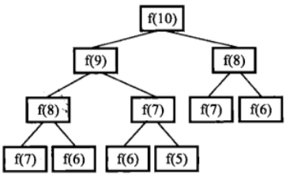

# 第4篇

知识点：递归和循环

## 斐波那契数列

### 要求
大家都知道斐波那契数列，现在要求输入一个整数n，请你输出斐波那契数列的第n项。
n<=39

斐波那契数列的定义： F(0)=0，F(1)=1, F(n)=F(n-1)+F(n-2)（n>=2，n∈N*）

### 代码
版本1：
```python
class Solution:
    def Fibonacci(self, n):
        # 定义： F(0)=0，F(1)=1, F(n)=F(n-1)+F(n-2)（n>=2，n∈N*）
        if n == 0:
            return 0
        elif n == 1:
            return 1
        else:
            return self.Fibonacci(n-1) + self.Fibonacci(n-2)
 ```
 问题：效率太低，满足不了oj的效率要求。且有很多重复计算！
 


改进：可以从下往上计算，从0，1一直叠加到n，就像人工做计算那样，从而避免重复

```python
class Solution:
    def Fibonacci(self, n):
        # 定义： F(0)=0，F(1)=1, F(n)=F(n-1)+F(n-2)（n>=2，n∈N*）
        if n == 0:
            return 0
        elif n == 1:
            return 1
        else:
            fib0 = 0
            fib1 = 1
            for _ in range(2, n+1):
                temp = fib1
                fib1 = fib0 + fib1
                fib0 = temp
            return fib1
```
妙用python语言的性质，for里面可以写成这样：
```python
for _ in range(2, n+1):
       fib0, fib1 = fib1, fib0 + fib1
```


## 跳台阶

### 要求
一只青蛙一次可以跳上1级台阶，也可以跳上2级。求该青蛙跳上一个n级的台阶总共有多少种跳法。

### 思路
青蛙某次可以是在之前跳了(n-1)级的基础上，再跳了1级到达第n级，也可以是在之前跳了(n-2)级的基础上，再跳了2级到达第n级……依次类推，发现其实是一个斐波那契数列。


### 代码
```python
class Solution:
    def jumpFloor(self, number):
        # 思路：斐波那契数列问题，从后往前看，f(n) = f(n-1) + f(n-2)
        # f(1) = 1,  f(2) = 2 
        if number <= 2:
            return number
        else:
            fib1 = 1
            fib2 = 2
            for _ in range(3, number+1):
                fib1, fib2 = fib2, fib1+fib2
            return fib2
```


## 变态跳台阶
### 要求
一只青蛙一次可以跳上1级台阶，也可以跳上2级……它也可以跳上n级。求该青蛙跳上一个n级的台阶总共有多少种跳法。

### 思路
思路与上一题类似，只不过在第n次时，要考虑到前面的各种情况，也就是说，到第n个台阶之前，可以是从（0）一步登天过来的，也可以是从（1）跳过来的，也可是从（2）跳过来的，把各种情况加起来。

思考时是从n往前思考，但实现时，要从前往后累加，避免重复计算。

### 代码
```python
class Solution:
    def jumpFloorII(self, number):
        # f(n)   = once + f(1) + f(2) + ... + f(n-3) + f(n-2) + f(n-1)
        # f(n-1) = once + f(1) + f(2) + ... + f(n-3) + f(n-2)
        # f(n-2) = once + (1) + f(2) + ... + f(n-3)
        # ...
        # f(4) = once + f(1) + f(2) + f(3)
        # f(3) = once + f(1) + f(2)
        # f(2) = once + f(1)
        # f(1) = once
        # once = 1
        # 前面加上once表示考虑到之前未跳过，一次就跳到这一级的情况,once应该为1
        return 2 ** (number-1)
```

其实观察一下，就能发现f(n) = 2 ^ (n-1)，这还写个毛线代码，直接return就ok了……


## 矩形覆盖
### 要求
我们可以用2*1的小矩形横着或者竖着去覆盖更大的矩形。请问用n个2*1的小矩形无重叠地覆盖一个2*n的大矩形，总共有多少种方法？

### 思路
宽度为n，可以用一个小矩形竖着放，占据1宽度，也可以用两个小矩形横着放，占据2宽度。这不还是跳台阶问题嘛

### 代码
不重复了，就是上面的跳台阶。

