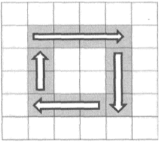
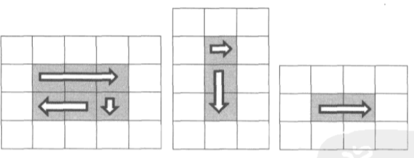

# 第 7 篇


## 二叉树的镜像
### 问题
操作给定的二叉树，将其变换为源二叉树的镜像。
```
二叉树的镜像定义：
         源二叉树 
    	    8
    	   /  \
    	  6   10
    	 / \  / \
    	5  7 9 11
        
    	镜像二叉树
    	    8
    	   /  \
    	  10   6
    	 / \  / \
    	11 9 7  5
```
### 思路
遍历树的每个节点，交换其左右子树就行。先序遍历或者后序遍历都可以，中序其实也行==


### 代码
```python
# -*- coding:utf-8 -*-
# class TreeNode:
#     def __init__(self, x):
#         self.val = x
#         self.left = None
#         self.right = None
class Solution:
    # 返回镜像树的根节点
    def Mirror(self, root):
        # 思路 先序/后序遍历二叉树 当某节点被访问时 就交换其左右子树指针、
        if not root:
            return
        self.Mirror(root.left)
        self.Mirror(root.right)
        root.left, root.right = root.right, root.left
        return root
```

 ## 顺时针打印矩阵
 ### 问题
 输入一个矩阵，按照从外向里以顺时针的顺序依次打印出每一个数字，例如，如果输入如下矩阵： 1 2 3 4 5 6 7 8 9 10 11 12 13 14 15 16 则依次打印出数字1,2,3,4,8,12,16,15,14,13,9,5,6,7,11,10.

 ### 思路
 一圈一圈打印，如果理不清过程和边界条件，这个题就gg了。



注意到每一圈开头第一个格子在左上角，坐标为（0，0），（1，1），（2，2），依此类推，如果是5x5矩阵，最后一圈只有一个格子，起始坐标是（2，2）；如果是6x6矩阵，最后一圈有4个格子，起始坐标也是（2，2）。仔细分析，可以得出条件：如果起始startx2<columns且startx2<rows，则继续打印这一圈，否则不再打印。明确这些条件，可以写外层循环。

打印每一圈分为4步，第一行走到头，下移一格然后把最后一列走到底，左移一格把最后一行走到头，然后上移一格走到顶。


需要注意特殊情况，可能一圈只能走3/2/1步。分析一下，第一步走完第一行，总是会执行的。要执行第二步，要求行数多于1，要想执行第三步，要求行数多于1且列数多于1，要想执行第四步，要求行数多于2且列数多于1。明确了这些条件，可以写走一圈的代码。

### 代码
```python
class Solution:
    # matrix类型为二维列表，需要返回列表
    def printMatrix(self, matrix):
        if not matrix:
            return matrix
        rows = len(matrix)
        cols = len(matrix[0])
        result = []
        start = 0
        # 判断是否继续往里走一圈
        while cols > start * 2 and rows > start * 2:
        	# 走一圈的代码
            end_x = cols - 1 - start
            end_y = rows - 1 - start
            # 打印第一行
            for i in range(start, end_x+1):
                result.append(matrix[start][i])
            # 打印最后一列
            if start < end_y:
                for i in range(start+1, end_y+1):
                    result.append(matrix[i][end_x])
            # 打印最后一行
            if start < end_x and start < end_y:
                for i in range(end_x-1, start-1, -1):
                    result.append(matrix[end_y][i])
            # 打印第一列
            if start < end_x and start < end_y - 1:
                for i in range(end_y-1, start, -1):
                    result.append(matrix[i][start])
            start += 1
        return result
```

### 更多
另一种很骚气的操作是，先取出第一行，打印，删掉，然后把矩阵按照逆时针旋转90°，仍然是取出第一行，打印，删掉……重复操作，直到删光。

矩阵的旋转操作可以这样进行：
【1，2，3】
【4，5，6】
如果是顺时针旋转90°，则先上下翻转矩阵，然后做转置
翻转得到
【4，5，6】
【1，2，3】
转置得到
【4，1】
【5，2】
【6，3】
如果是逆时针旋转90°，则先做转置，然后上下翻转矩阵
转置得到
【1，4】
【2，5】
【3，6】
翻转得到
【3，6】
【2，5】
【1，4】

```python
# 在python中实现矩阵旋转
# 原矩阵
matrix = [
    [1, 2, 3, 4, 5],
    [6, 7, 8, 9, 10],
    [11, 12, 13, 14, 15]
]
# 顺时针旋转90°
mt = [[]]
mt[:] = map(list,zip(*matrix[::-1]))  

# 逆时针旋转90°
mt2 = [[]]
mt2[:] = map(list,zip(*matrix))
mt2 = mt2[::-1]

# 说明
# [::-1]的操作相当于翻转，意思是从后往前逐个读取列表中的元素
# zip(*matrix)的意思相当于转置
# 结果为
# (1, 6, 11)
# (2, 7, 12)
# (3, 8, 13)
# (4, 9, 14)
# (5, 10, 15)
```

那么这个题目用上面旋转的骚操作的代码：
```python
    def printMatrix(self, matrix):
        if not matrix:
            return matrix
        result = []
        while len(matrix) > 0:
            result.extend(matrix[0])
            matrix = zip(*matrix[1:])[::-1]
        return result
```

## 包含min函数的栈
### 问题
定义栈的数据结构，请在该类型中实现一个能够得到栈最小元素的min函数。
准确来说，就是为栈增加一个函数，调用此函数时，可以获取栈中的最小值。

### 思路
原始思路是，保存一个最小值，每当新值入栈时，就比较一下，更新此最小值。
但问题是，如果最小值出栈，或者说有多个最小值，其中某一个最小值出栈/全部最小值都已出栈，如何更新？如何判断？会带来比较复杂的问题。

较好的思路：开一个新栈，此栈与数值栈一一对应，在元素入栈时，就记录处于每一个位置时的当前最小值，这样不论什么情况，不论之前如何出栈入栈，都能立即获取到最小值。


### 代码
```python
# -*- coding:utf-8 -*-
class Solution:
    
    def __init__(self):
        self.cursor = -1
        self.main_stack = []
        self.min_stack = []

    def push(self, node):
        if self.cursor == -1:
            self.main_stack.append(node)
            self.min_stack.append(node)
        else:
            if self.min_stack[self.cursor] <= node:
                self.min_stack.append(self.min_stack[self.cursor])
            else:
                self.min_stack.append(node)
            self.main_stack.append(node)
        self.cursor += 1
        
    def pop(self):
        if self.cursor == -1:
            return None
        else:
            del self.min_stack[self.cursor]
            result = self.main_stack[self.cursor]
            del self.main_stack[self.cursor]
            self.cursor -= 1
            return result
            
    def top(self):
        if self.cursor == -1:
            return None
        else:
            return self.main_stack[self.cursor]
            
    def min(self):
        if self.cursor == -1:
            return None
        else:
            return self.min_stack[self.cursor]
```

## 栈的压入、弹出序列
### 问题
输入两个整数序列，第一个序列表示栈的压入顺序，请判断第二个序列是否为该栈的弹出顺序。假设压入栈的所有数字均不相等。例如序列1,2,3,4,5是某栈的压入顺序，序列4，5,3,2,1是该压栈序列对应的一个弹出序列，但4,3,5,1,2就不可能是该压栈序列的弹出序列。（注意：这两个序列的长度是相等的）

### 思路
模拟栈的弹出过程
读取弹出序列，如果读到的元素在栈顶，则弹出；
如果不在栈顶，则按照压入顺序压入元素，直到压到当前读到的弹出元素为止，然后继续弹出此元素。
如果压入序列已经读完，仍然没有读到当前弹出元素，说明这个元素可能已经是早就被压入，但是却早于比它后被压入的元素弹出，因此弹出序列有问题。

例如对于压入顺序 12345和弹出顺序45312，首先读到4，则从压入序列里依次压入1234，然后弹出4；读到5，则压入5，弹出5；读到3，栈顶恰好为3，弹出3；读到1，栈顶为2，应当继续压入直到压入1，但压入序列已经读完，没找到1，所以错误。


### 代码
```python
    def IsPopOrder(self, pushV, popV):
        # 逐个读取pop序列
        # 如果是位于栈顶，则pop
        # 如果不是，则读取push序列，依次入栈，直到压入要弹出的元素，然后弹出
        # 如果push读完但仍没找到，则错误
        
        stack = []
        push_cursor = 0
        for pop in popV:
            if stack and pop == stack:
                stack.pop()
            else:
                while not(stack and pop == stack[-1]) and push_cursor < len(pushV):
                    stack.append(pushV[push_cursor])
                    push_cursor += 1
                if push_cursor == len(pushV) and stack[-1] != pop:
                    return False
                else:
                    stack.pop()
        return True
```

## 从上往下打印二叉树（二叉树层级遍历）
### 问题
从上往下打印出二叉树的每个节点，同层节点从左至右打印。

### 思路
本质上是图的广度优先遍历思想。
借助队列来辅助实现，先把根节点加入队列。每次从队列头取出一个节点，访问，然后把它的左右孩子节点加入队列尾部。重复过程，直到队列为空，则按照层级，访问了所有节点。

### 代码
```python
class Solution:
    # 返回从上到下每个节点值列表，例：[1,2,3]
    def PrintFromTopToBottom(self, root):
        # 使用队列来辅助进行广度优先
        if not root:
            return []
        queue = [root, ]
        output = []
        while(queue):
            output.append(queue[0].val)
            if queue[0].left:
                queue.append(queue[0].left)
            if queue[0].right:
                queue.append(queue[0].right)
            queue.pop(0)
        return
```

## 二叉搜索树的后序遍历序列

### 二叉搜索树
二叉搜索树（又称二叉排序树、二叉查找树） 的一些知识 见 ：
https://blog.csdn.net/yanxiaolx/article/details/51986428
https://blog.csdn.net/yixianfeng41/article/details/52802855

### 问题
输入一个整数数组，判断该数组是不是某二叉搜索树的后序遍历的结果。如果是则输出Yes,否则输出No。假设输入的数组的任意两个数字都互不相同。


### 思路
举例子来分析一下规律。
以{5，7，6，9，11，10，8}为例，最后一个节点就是根节点，因此以8为界，前面576是左子树，后面9，11，10是右子树。递归下去，根为6，5是左子树，7是右子树。10是根，9是左，11是右，ok。
以{7，4，6，5}为例，5为根，第一个元素就是7，说明没有左子树，全都右子树。但是右子树中出现了4比5小，所以不对。

需整理一下判断过程：
1）利用根节点，划分左右子树
2）检查，右子树的值必须都大于根节点
3）递归下去，判断左子树和右子树，且两个子树的结果均ok，才算ok


### 代码
```python
# -*- coding:utf-8 -*-
class Solution:
    def VerifySquenceOfBST(self, sequence):
        # 递归的过程，每一个子树最后一个元素是根节点，且前一段都比它小，后一段都比它大
        if not sequence:
            return False
        # 找到根节点
        root = sequence[-1]
        split = len(sequence) - 1
        # 找到划分点
        for i in range(0, len(sequence)-1):
            if sequence[i] >= root:
                split = i
                break
        # 确认后半段都比root大
        for i in range(split, len(sequence)-1):
            if sequence[i] <= root:
                return False
        # 递归检查前半段和后半段
        left = True
        if split > 0:
        	# 前半段至少有两个元素，才递归
            left = self.VerifySquenceOfBST(sequence[0:split])
        right = True
        if split < len(sequence) - 1:
        	# 后半段至少有两个元素，才递归
            right = self.VerifySquenceOfBST(sequence[split:-1])
        return left and right
```

## 二叉树中和为某一值的路径
### 问题
输入一颗二叉树和一个整数，打印出二叉树中结点值的和为输入整数的所有路径。路径定义为从树的根结点开始往下一直到叶结点所经过的结点形成一条路径。


### 思路
采用递归，先序遍历。保留一个序列，存放当前路径，访问到某节点时，将其加入路径，并递归访问其孩子。如果遇到叶节点，加入路径，计算路径之和，如果和满足要求，则输出路径。继续后退到上一级时，从路径中删除下级节点。

例如，树
```
        10
    5        12
4      7
```
整个过程如下


分析路径的加入和删除，发现符合栈的结构。

### 代码
```
# -*- coding:utf-8 -*-
# class TreeNode:
#     def __init__(self, x):
#         self.val = x
#         self.left = None
#         self.right = None
import copy

class Solution:
    def __init__(self):
        self.result = []
        self.stack = []
        self.sum = 0
        
    # 返回二维列表，内部每个列表表示找到的路径
    def FindPath(self, root, expectNumber):
        if not root:
            return []
        self.Find(root, expectNumber)
        return self.result
    
    def Find(self, root, exp):
        self.stack.append(root.val)
        self.sum += root.val
        if root.left:
            self.Find(root.left, exp)
        if root.right:
            self.Find(root.right, exp)
        if not(root.left or root.right):
            if self.sum == exp:
                self.result.append(copy.deepcopy(self.stack))
        self.sum -= root.val
```
注意几点：
1）只当叶节点时才判断sum，因为这是根据定义的要求，路径必须结束在叶节点
2）注意python中的深浅拷贝，在append时如果直接append了stack，后面stack都pop光了，最后只剩下一堆空列表。可以用深拷贝，或者用`[n for n in self.stack]`这种列表生成式的方式。


------

本文稿来自 https://github.com/dox1994/offer-coding-interviews-python，欢迎前来给个star🌟～ 如有错误或遗漏欢迎issue～